<div align="center">

# ⚡ Hybrid RAG Intelligence Engine

**Enterprise-grade Retrieval-Augmented Generation for SEC 10-K Financial Document Q&A**

[](https://github.com/JayKalbi/hybrid-rag-engine/actions)
[](https://www.python.org/downloads/)
[](LICENSE)
[](https://github.com/astral-sh/ruff)

</div>

---

## 🎯 What This Is

A **production-hardened hybrid retrieval pipeline** that answers natural-language questions about SEC 10-K filings using a multi-stage retrieval strategy:

```
Query → [Dense Search + Sparse Search] → RRF Fusion → Cross-Encoder Rerank → LLM Generation
```

Unlike simple "embed-and-retrieve" RAG systems, this engine combines **semantic understanding** (dense vectors) with **exact keyword matching** (BM25) and uses **Reciprocal Rank Fusion** to merge results before a **Cross-Encoder** performs fine-grained reranking.

---

## 🏗 Architecture

```mermaid
graph LR
    subgraph Ingestion Pipeline
        A[📄 PDF/TXT/HTML/MD] --> B[Document Loader]
        B --> C[Chunker + Dedup]
        C --> D[Dense Index<br/>ChromaDB]
        C --> E[Sparse Index<br/>BM25]
    end

    subgraph Retrieval Pipeline
        F[User Query] --> G[Dense Retriever<br/>MiniLM-L6-v2]
        F --> H[Sparse Retriever<br/>BM25 Okapi]
        G --> I[Reciprocal Rank<br/>Fusion]
        H --> I
        I --> J[Cross-Encoder<br/>Reranker]
    end

    subgraph Generation
        J --> K[Grounded Generator<br/>Llama 3.1 8B]
        K --> L[Citation Extractor<br/>+ Validator]
        L --> M[✅ Verified Answer<br/>with Sources]
    end

    style D fill:#4f46e5,color:#fff
    style E fill:#0891b2,color:#fff
    style I fill:#7c3aed,color:#fff
    style J fill:#db2777,color:#fff
    style K fill:#059669,color:#fff
```



---

## ✨ Key Features

| Feature | Description |
|---|---|
| **Hybrid Retrieval** | Combines dense (semantic) and sparse (keyword) search for superior recall |
| **Reciprocal Rank Fusion** | Mathematically merges ranked lists without requiring score normalization |
| **Cross-Encoder Reranking** | Two-stage retrieval: fast bi-encoder recall → precise cross-encoder precision |
| **Grounded Generation** | Strict system prompt enforcing context-only answers with inline citations |
| **Citation Validation** | Automatically detects hallucinated citations not present in retrieved context |
| **LLM-as-Judge Evaluation** | Uses Llama 3.3 70B to score Llama 3.1 8B outputs for relevance and accuracy |
| **Audit Trail** | Every query, response, and source access is logged for compliance |
| **Rate Limiting** | Token-bucket rate limiter with per-IP tracking |
| **Security Headers** | XSS protection, content-type sniffing prevention, frame denial |
| **Health Checks** | `/health` and `/ready` endpoints for container orchestration |
| **Multi-Panel Dashboard** | 3-panel UI with conversation history, live metrics, and source viewer |
| **Docker Ready** | Multi-stage Dockerfile with non-root user and WSGI server |
| **CI/CD Pipeline** | GitHub Actions: lint → test → Docker build on every push |

---

## 🚀 Quick Start

### Prerequisites
- Python 3.10+
- [Groq API Key](https://console.groq.com/) (free tier available)

### 1. Clone & Setup

```bash
git clone https://github.com/JayKalbi/hybrid-rag-engine.git
cd hybrid-rag-engine

python -m venv venv
source venv/bin/activate  # Windows: venv\Scripts\activate

pip install -r requirements.txt
pip install -e .
```

### 2. Configure Environment

```bash
cp .env.example .env
# Edit .env and add your GROQ_API_KEY
```

### 3. Ingest Documents

Place your SEC 10-K PDFs in `data/documents/`, then run:

```bash
python -m src.ingestion.ingest_pipeline
```

### 4. Start the Server

```bash
# Development
python app/app.py

# Production
waitress-serve --host=0.0.0.0 --port=5000 app.app:app
```

### 5. Open the Dashboard

Navigate to [http://localhost:5000](http://localhost:5000)

### Docker

```bash
docker compose up --build
```

---

## 🧪 Testing

```bash
# Install dev dependencies
pip install -e ".[dev]"

# Run all tests
pytest tests/ -v --cov=src

# Run only unit tests (no ML models needed)
pytest tests/unit/ -v

# Lint check
ruff check src/ tests/
```

---

## 📊 Evaluation

Generate a golden dataset and run automated evaluation:

```bash
# Generate synthetic Q&A pairs
python -m src.evaluation.golden_dataset

# Run LLM-as-Judge evaluation
python -m src.evaluation.evaluator
```

---

## 🛠 Tech Stack

| Layer | Technology |
|---|---|
| **Embedding Model** | `sentence-transformers/all-MiniLM-L6-v2` |
| **Cross-Encoder** | `cross-encoder/ms-marco-MiniLM-L-6-v2` |
| **Vector Store** | ChromaDB |
| **Sparse Index** | BM25 Okapi (rank-bm25) |
| **LLM** | Llama 3.1 8B Instant via Groq |
| **Judge LLM** | Llama 3.3 70B Versatile via Groq |
| **Framework** | LangChain |
| **Web Server** | Flask + Waitress (WSGI) |
| **Containerization** | Docker |
| **CI/CD** | GitHub Actions |

---

## 📁 Project Structure

```
hybrid-rag-engine/
├── app/
│   ├── app.py                    # Flask API server
│   └── templates/
│       └── index.html            # Multi-panel dashboard
├── src/
│   ├── config.py                 # Centralized configuration
│   ├── logging_config.py         # Structured logging
│   ├── middleware.py              # Rate limiting, security, audit
│   ├── ingestion/
│   │   ├── document_loader.py    # Multi-format doc loading
│   │   ├── chunker.py            # Chunking + deduplication
│   │   ├── embedder.py           # Dense + sparse indexing
│   │   └── ingest_pipeline.py    # Orchestrator
│   ├── retrieval/
│   │   ├── dense_retriever.py    # ChromaDB vector search
│   │   ├── sparse_retriever.py   # BM25 keyword search
│   │   ├── hybrid_retriever.py   # RRF fusion + orchestration
│   │   └── reranker.py           # Cross-encoder reranking
│   ├── generation/
│   │   ├── generator.py          # Grounded LLM generation
│   │   ├── citation_extractor.py # Citation parsing + validation
│   │   └── rag_chain.py          # End-to-end pipeline
│   └── evaluation/
│       ├── evaluator.py          # LLM-as-Judge scoring
│       └── golden_dataset.py     # Synthetic Q&A generation
├── tests/
│   ├── conftest.py               # Shared fixtures
│   ├── unit/                     # Unit tests (no models needed)
│   └── integration/              # API endpoint tests
├── data/
│   └── documents/                # Source SEC 10-K PDFs
├── .github/workflows/ci.yml     # CI pipeline
├── Dockerfile                    # Production container
├── docker-compose.yml            # Service orchestration
├── pyproject.toml                # Python packaging + tool config
├── requirements.txt              # Dependencies
└── .env.example                  # Environment template
```

---

## 📝 Design Decisions

| Decision | Rationale |
|---|---|
| **RRF over linear fusion** | RRF doesn't require score normalization between dense and sparse — more robust |
| **Two-stage retrieval** | Bi-encoder for fast recall (15 candidates), cross-encoder for precise reranking (top 5) |
| **BM25 alongside dense** | Dense search misses exact keyword matches; BM25 catches acronyms, ticker symbols, specific numbers |
| **Groq over OpenAI** | Free tier, extremely fast inference, supports Llama 3.1 models |
| **ChromaDB over Pinecone** | Local-first, no external API dependency, suitable for SEC filing volumes |
| **SHA-256 deduplication** | Content-hash-based IDs enable idempotent re-ingestion without duplicates |

---

## 📄 License

MIT License — see [LICENSE](LICENSE) for details.
